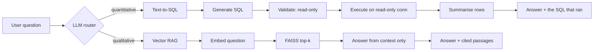

# Architecture

How a question becomes an answer, and why the system is built in two halves.

---

## The problem this solves

A hospital's knowledge lives in two incompatible shapes.

**Structured**: 54,966 admission records in a table. Answering *"which condition
has the longest average stay?"* means aggregating rows. Retrieval-augmented
generation is the wrong tool — you cannot embed your way to a `GROUP BY`, and
stuffing 54,966 rows into a context window is neither possible nor useful.

**Unstructured**: policy manuals and clinical guidelines. Answering *"who
qualifies for charity care?"* means finding the paragraph that says so. SQL is
the wrong tool — there is no column for it.

A system that only does one of these fails half the questions. So this one does
both, and puts a router in front to decide which.

---

## The flow



The router never sees the data. It sees the question, picks a lane, and the
chosen pipeline does the rest.

---

## Module map

| Module | Responsibility |
|---|---|
| [`config.py`](../config.py) | Every tunable, overridable by environment variable |
| [`llm.py`](../llm.py) | Provider factory — Groq, DeepSeek or OpenAI behind one interface |
| [`preprocess.py`](../preprocess.py) | Raw CSV → clean frame + audit report |
| [`database.py`](../database.py) | Clean frame → SQLite, with indexes |
| [`policies_content.py`](../policies_content.py) | The policy corpus, as text |
| [`vectorstore.py`](../vectorstore.py) | Corpus → PDFs → chunks → FAISS |
| [`router.py`](../router.py) | Question → `"sql"` or `"rag"` |
| [`sql_chain.py`](../sql_chain.py) | Text-to-SQL, validated and executed read-only |
| [`rag_chain.py`](../rag_chain.py) | Retrieve, then answer strictly from context |
| [`analytics.py`](../analytics.py) | Dashboard aggregations, pure SQL, no LLM |
| [`pipeline.py`](../pipeline.py) | `initialize()`, `answer()`, `answer_events()` |
| [`server.py`](../server.py) | FastAPI, including the SSE stream |
| [`app.py`](../app.py) / [`cli.py`](../cli.py) | Gradio and terminal front ends |
| [`web/`](../web) | Next.js frontend |

Dependencies point one way: front ends depend on `pipeline`, `pipeline` depends
on the chains, the chains depend on `llm` and the stores. Nothing imports a
front end.

---

## The router

An LLM classifies each question into `sql` or `rag`. The prompt describes what
each pipeline can reach — the database's columns on one side, the policy topics
on the other — rather than listing example phrasings, so a question the author
never anticipated still lands somewhere sensible.

**Routing never hard-fails.** If the provider is unreachable or returns
something unparseable, [`_keyword_route()`](../router.py) decides from keyword
counts instead. This is not theoretical: during development Groq retired the
configured model mid-session, and the app kept routing correctly on the
fallback while every LLM call returned 404.

```python
try:
    raw = get_router().invoke({"question": question})
except Exception:
    return _keyword_route(question)      # degrade, don't die
```

---

## Text-to-SQL, and why it is safe

Letting a language model write SQL against your database is the sharp edge of
this design. It is fenced in three independent places, so no single failure is
enough.

**1. Prompt.** The model is told to emit one read-only `SELECT`, given the
schema, and told the exact spelling of every categorical value so it does not
invent `'CANCER'` for `'Cancer'`.

**2. Validation.** [`validate_sql()`](../sql_chain.py) rejects anything that is
not a single `SELECT`/`WITH`: multiple statements, any DDL or DML keyword, an
empty string. [`enforce_limit()`](../sql_chain.py) appends `LIMIT` when the
model didn't set one, so a broad query cannot flood the context window.

**3. Connection.** Queries execute over `file:...?mode=ro`. Even a statement
that somehow passed validation cannot write.

That third layer is what makes the first two defence in depth rather than the
only defence. It is covered by a test that asserts `CREATE TABLE` raises at the
driver level, not at the validator.

The generated SQL is produced **once** and both executed and displayed, so what
the UI shows is always the query that actually ran — never a re-generated
approximation of it.

---

## Vector RAG

The corpus is authored as Python strings, rendered to PDF, then loaded back
through `PyPDFLoader`. The round trip is deliberate: retrieval exercises real
PDF parsing, which is what it would do against a hospital's actual policy
library. Embedding the strings directly would test a path that does not exist
in production.

- Chunking: 600 characters, 80 overlap, split on paragraph → line → sentence
- Embeddings: `all-MiniLM-L6-v2`, local, no API key, normalised
- Index: FAISS, 37 chunks from 9 PDF pages
- Retrieval: top 4

The answer prompt is closed-book: answer from the context or return a fixed
refusal. Retrieval happens once per question and the same documents feed both
the answer and the citations, so a citation always points at text the model
actually saw.

---

## Streaming

`answer()` returns a finished result. `answer_events()` yields the pipeline's
progress as it happens, and `server.py` forwards those as server-sent events:

```
stage(routing) → route(sql) → stage(generating_sql) → sql(...)
→ stage(executing_sql) → rows(...) → stage(answering) → token × N → done
```

The pipeline is synchronous and LLM-bound, so it runs in a worker thread and
hands events back through an `asyncio.Queue` rather than blocking the event
loop.

This is why the UI can show the SQL *before* it runs and the rows *before* the
prose is written — the interface reflects the architecture instead of hiding it
behind a spinner.

---

## Frontend

Next.js 16 App Router, React 19, Tailwind v4, Recharts. Four views over one
backend: streaming chat, analytics dashboard, the preprocessing audit, and the
document corpus.

Two decisions worth naming:

**Panels stay mounted.** Switching tabs hides a panel rather than unmounting
it. Otherwise every tab switch refetches every endpoint and discards the
conversation.

**One motion system.** Cards fade in via an `IntersectionObserver`; Recharts'
own entry animation is disabled. Two animation systems on the same element is
redundant, and Recharts drives its animation with `requestAnimationFrame`,
which a throttled renderer can stall — leaving bars frozen at zero height. The
reveal observer has a timer backstop for the same reason.

---

## Extending it

**A third route** (say, a web search for questions the data cannot answer):
add the route constant to `router.py`, describe it in the router prompt, write
a `query_x()` returning a dict with an `answer` key, and dispatch to it in
`pipeline.answer()`. The front ends read `result["route"]` generically.

**A different dataset**: rewrite `preprocess.py` and `CREATE_TABLE_SQL`, then
update the schema notes in `SQL_PROMPT`. Nothing else in the SQL path is
dataset-specific.

**A different provider**: add a `Provider` entry in `llm.py`. Anything
OpenAI-compatible only needs a `base_url`.
